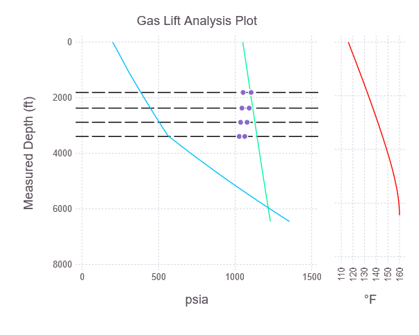
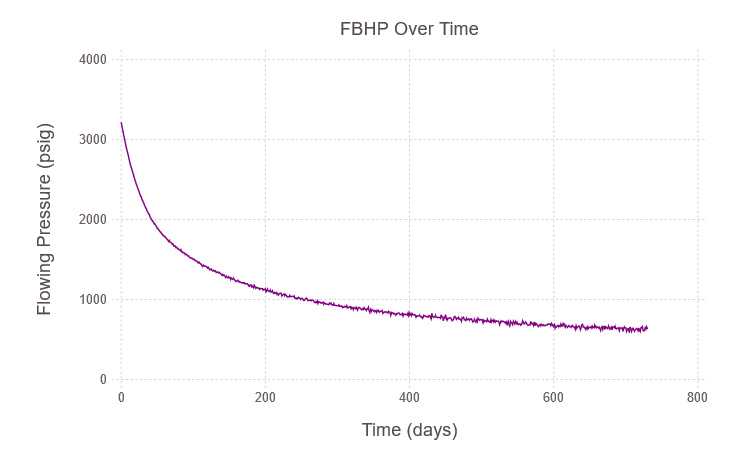

# PressureDrop.jl
[](https://travis-ci.org/jnoynaert/PressureDrop.jl)  [](https://jnoynaert.github.io/PressureDrop.jl/stable)  [](https://doi.org/10.21105/joss.01642)


Julia package for computing multiphase pressure profiles for gas lifted oil &amp; gas wells, developed as an open-source alternative to feature subsets of commercial nodal analysis or RTA software such as Prosper, Pipesim, or IHS Harmony (some comparisons [here](https://jnoynaert.github.io/PressureDrop.jl/stable/similartools/)).

Currently calculates outlet-referenced models for producing wells using non-coupled temperature gradients.

In addition to being open-source, `PressureDrop.jl` has several advantages over closed-source applications for its intended use cases:
- Programmatic and scriptable use with native code--no binaries consuming configuration files or awkward keyword specifications
- Dynamic recalculation of injection points and temperature profiles through time
- Easy duplication and modification of models and scenarios
- Extensible PVT or pressure correlation options by adding functions in Julia code (or C, Python, or R)
- Utilization of Julia's interoperability with other languages for adding or importing new functions for model components

Changelog [here](changelog.md).

# Installation

From the Julia prompt: press `]`, then type `add PressureDrop`.

Alternatively, in Jupyter: execute a cell containing `using Pkg; Pkg.add("PressureDrop")`.

# Usage

Models are constructed from well objects, optional valve objects, and parameter specifications. Well and valve objects can be constructed manually or [from files](https://jnoynaert.github.io/PressureDrop.jl/stable/core/#Wellbores-1) (see [here](test/testdata/Sawgrass_9_32/Test_survey_Sawgrass_9.csv) for an example well input file and [here](test/testdata/valvedata_wrappers_1.csv) for an example valve file).

Note that all inputs and calculations are in U.S. field units:

```julia
julia> using PressureDrop

julia> surveyfilepath = joinpath(dirname(dirname(pathof(PressureDrop))), "test/testdata/Sawgrass_9_32/Test_survey_Sawgrass_9.csv")

julia> examplewell = read_survey(path = surveyfilepath, id = 2.441, maxdepth = 6500)

Wellbore with 67 points.
Ends at 6459.0' MD / 6405.05' TVD.
Max inclination 13.4°. Average ID 2.441 in.

julia> valvefilepath = joinpath(dirname(dirname(pathof(PressureDrop))), "test/testdata/valvedata_wrappers_1.csv")

julia> examplevalves = read_valves(path = valvefilepath)

Valve design with 4 valves and bottom valve at 3395.0' MD.

julia> model = WellModel(wellbore = examplewell, roughness = 0.00065, valves = examplevalves,
                         pressurecorrelation = BeggsAndBrill,
                         WHP = 200, #wellhead pressure, psig
                         CHP = 1050, #casing pressure, psig
                         dp_est = 25, #estimated ΔP by segment. Not critical
                         temperature_method = "Shiu", #temperatures can be calculated or provided directly as a array
                         BHT = 160, geothermal_gradient = 0.9,  #°F, °F/100'
                         q_o = 100, q_w = 500, #bpd
                         GLR = 2500, naturalGLR = 400, #scf/bbl
                         APIoil = 35, sg_water = 1.05, sg_gas = 0.65);
```

Once a model is specified, developing pressure/temperature traverses or gas lift analysis is simple:

```julia
julia> tubing_pressures, casing_pressures, valvedata = gaslift_model!(model, find_injectionpoint = true,
               dp_min = 100) #required minimum ΔP at depth to consider as an operating valve

Flowing bottomhole pressure of 964.4 psig at 6459.0' MD.
Average gradient 0.149 psi/ft (MD), 0.151 psi/ft (TVD).

julia> using Gadfly #necessary to make integrated plotting functions available

julia> plot_gaslift(model, tubing_pressures, casing_pressures, valvedata, "Gas Lift Analysis Plot") #expect a long time to first plot due to precompilation; subsequent calls will be faster
```


Valve tables can be generated from the output of the gas lift model:

```julia
julia> valve_table(valvedata)

╭─────┬──────┬──────┬──────┬──────┬───────┬───────┬──────┬──────┬──────┬──────┬──────┬──────┬──────┬──────┬───────┬───────┬───────╮
│ GLV │   MD │  TVD │  PSO │  PSC │  Port │     R │ PPEF │ PTRO │   TP │   CP │  PVO │  PVC │ T_td │ T_cd │   Q_o │ Q_1.5 │   Q_1 │
│     │   ft │   ft │ psig │ psig │ 64ths │       │    % │ psig │ psig │ psig │ psig │ psig │   °F │   °F │ mcf/d │ mcf/d │ mcf/d │
├─────┼──────┼──────┼──────┼──────┼───────┼───────┼──────┼──────┼──────┼──────┼──────┼──────┼──────┼──────┼───────┼───────┼───────┤
│   4 │ 1813 │ 1806 │ 1055 │ 1002 │    16 │ 0.073 │    8 │ 1005 │  384 │ 1100 │ 1104 │ 1052 │  132 │  112 │  1480 │  1125 │   888 │
│   3 │ 2375 │ 2357 │ 1027 │  979 │    16 │ 0.073 │    8 │  990 │  446 │ 1115 │ 1092 │ 1045 │  136 │  116 │  1493 │  1135 │   896 │
│   2 │ 2885 │ 2856 │  999 │  957 │    16 │ 0.073 │    8 │  975 │  504 │ 1129 │ 1078 │ 1036 │  141 │  119 │  1506 │  1144 │   903 │
│   1 │ 3395 │ 3355 │  970 │  934 │    16 │ 0.073 │    8 │  960 │  568 │ 1143 │ 1063 │ 1027 │  145 │  123 │  1518 │  1154 │   911 │
╰─────┴──────┴──────┴──────┴──────┴───────┴───────┴──────┴──────┴──────┴──────┴──────┴──────┴──────┴──────┴───────┴───────┴───────╯
```

Bulk calculations can also be performed either time by either iterating a model object, or calling pressure traverse functions directly:

```julia
function timestep_pressure(rate, temp, watercut, GLR)
    temps = linear_wellboretemp(WHT = temp, BHT = 165, wellbore = examplewell)

    return traverse_topdown(wellbore = examplewell, roughness = 0.0065, temperatureprofile = temps,
                     pressurecorrelation = BeggsAndBrill, dp_est = 25, error_tolerance = 0.1,
                     q_o = rate * (1 - watercut), q_w = rate * watercut, GLR = GLR,
                     APIoil = 36, sg_water = 1.05, sg_gas = 0.65,
                     WHP = 120)[end]
end

pressures = timestep_pressure.(testdata, wellhead_temps, watercuts, GLRs)

plot(x = days, y = pressures, Geom.path, Theme(default_color = "purple"),
     Guide.xlabel("Time (days)"),
     Guide.ylabel("Flowing Pressure (psig)"),
     Scale.y_continuous(format = :plain, minvalue = 0),
     Guide.title("FBHP Over Time"))
```



See the [documentation](https://jnoynaert.github.io/PressureDrop.jl/stable) for more usage details.

# Supported pressure correlations

- Beggs and Brill, with the Payne correction factors. Best for inclined pipe.
- Hagedorn and Brown, with the Griffith and Wallis bubble flow adjustment.
- Casing (injection) pressure drops using corrected density but neglecting friction.

These methods do not account for oil-water phase slip and assume **steady-state conditions**.

# Performance

The pressure drop calculations converge quickly enough in most cases that special performance considerations do not need to be taken into account during interactive use.

For bulk calculations, note that as always with Julia, the best performance will be achieved by wrapping any calculations in a function, e.g. a `main()` block, to enable proper type inference by the compiler.

Plotting functions are lazily loaded to avoid the overhead of loading the `Gadfly` plotting dependency.

# Pull requests & bug reports

- Pull requests are welcome! For additional functionality, especially pressure correlations or PVT functions, please include unit tests.
- Please add any bug reports or feature requests to the [issue tracker](https://github.com/jnoynaert/PressureDrop.jl/issues). Ideally, include a [minimal, reproducible example](https://stackoverflow.com/help/minimal-reproducible-example) with any issue reports, along with additional necessary data (e.g. CSV definitions of well surveys).
